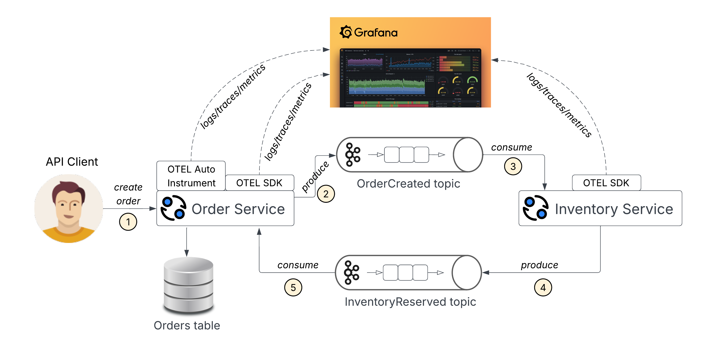

# Distributed Tracing Demo with OpenTelemetry and Grafana Cloud

A comprehensive demo showcasing **end-to-end distributed tracing** in a microservices architecture using OpenTelemetry and Grafana Cloud.

## 🎯 What You'll See

**Distributed Trace Flow in Grafana Cloud:**


*This shows the complete request flow across microservices connected via Kafka with full observability.*

## 🚀 Quick Start (3 Simple Steps)

### **Step 1: Download OpenTelemetry Java Agent**

> **TODO:** Review and set the correct path for the OpenTelemetry Java agent JAR file download location below before publishing!

Download the OpenTelemetry Java agent to `services/order-service/` directory:

```bash
# Download the agent to the exact location
curl -L -o services/order-service/opentelemetry-javaagent.jar \
  https://github.com/open-telemetry/opentelemetry-java-instrumentation/releases/latest/download/opentelemetry-javaagent.jar
```

**Note:** The JAR file must be placed in `services/order-service/` directory.

### **Step 2: Configure Grafana Cloud Credentials**

> **TODO:** Review and set proper Grafana Cloud URLs and instructions below before publishing!

1. **Get your Grafana Cloud API key:**
   - Sign up at [grafana.com](https://grafana.com)
   - Create a new stack
   - Go to 'Access Policies' → 'API Keys'
   - Create a new API key

2. **Update environment files:**
   ```bash
   # Copy template files
   cp services/order-service/.env.example services/order-service/.env
   cp services/inventory-service/.env.example services/inventory-service/.env
   ```

3. **Add your credentials to both .env files:**
   - Replace `YOUR_ENCODED_CREDENTIALS_HERE` with your actual Grafana credentials
   - Format: `Basic <your-base64-encoded-credentials>`

### **Step 3: Run the Demo**

```bash
# Start all services
docker compose -f docker-compose.full.yml up -d --build
```

### **Step 4: Test It!**

Create a test request:

```bash
curl -X POST http://localhost:8080/orders \
  -H "Content-Type: application/json" \
  -d '{
    "customer_id": "550e8400-e29b-41d4-a716-446655440000",
    "product_id": "550e8400-e29b-41d4-a716-446655440001", 
    "quantity": 2
  }'
```

### **Step 5: View Traces in Grafana Cloud**

> **TODO:** Review and update the instructions below with the exact path or navigation steps for your Grafana Cloud instance, including any direct URLs if possible.

1. Go to your Grafana Cloud instance
2. Navigate to "Explore" → "Tempo"
3. Search for traces by service name: `order-service` or `inventory-service`
4. You should see the distributed trace flow!

---

## 🔄 Workflow Diagram



*This diagram shows the end-to-end workflow of requests, events, and traces in the system.*

Below is a brief description of each step in the workflow:

1. The API client sends a request to the Order Service.  
2. The Order Service stores the order and publishes an event to Kafka.  
3. The Inventory Service receives the event and processes inventory.  
4. The Inventory Service publishes an inventory reserved event to Kafka.  
5. The Order Service updates the order status based on the inventory event.

Throughout this workflow, tracking data (spans) is sent to Grafana Cloud: the Java service sends both automatically captured spans and manual spans created through the SDK, while the Inventory Service sends only manual spans; all tracking data is linked via the trace id to provide a complete view of each request.

## 📋 Features

1. **Distributed Tracing**: End-to-end request tracking across Order Service and Inventory Service
2. **Message Queue**: Asynchronous communication via Apache Kafka
3. **Database Persistence**: PostgreSQL for data storage
4. **Observability**: OpenTelemetry integration with Grafana Cloud
5. **Containerized**: Docker Compose for easy deployment
6. **E2E Testing**: Automated test suite for validation

## 🛠️ Technology Stack

- **Order Service**: Java 17, Spring Boot, OpenTelemetry Java Agent
- **Inventory Service**: Go 1.24, Kafka consumer/producer, OpenTelemetry Go SDK
- **Message Queue**: Apache Kafka with Zookeeper
- **Database**: PostgreSQL 13
- **Observability**: OpenTelemetry + Grafana Cloud
- **Containerization**: Docker & Docker Compose

## 🔍 **Services Overview**

### **Order Service (Java/Spring Boot)**
- **Purpose**: Handles HTTP requests and publishes events to Kafka
- **Instrumentation**: 
  - **Auto-instrumentation** via OpenTelemetry Java Agent (HTTP, Database, Kafka operations)
  - **Manual spans** for business logic and custom operations
- **Communication**: Publishes order events to Kafka topics

### **Inventory Service (Go, Kafka only)**
- **Purpose**: Consumes Kafka events and processes inventory updates
- **Instrumentation**: OpenTelemetry Go SDK with manual instrumentation
- **Communication**: Subscribes to Kafka topics for order events
- **Note**: This service does not expose an HTTP API; it is a pure Kafka consumer/producer.

### **How They Communicate**
1. **Order Service** receives HTTP request → processes order → saves to database → publishes event to Kafka
2. **Inventory Service** consumes Kafka event → updates inventory → saves to database
3. **Full trace context** flows through Kafka headers, maintaining end-to-end visibility

## 🎯 **Instrumentation Strategy**

### **Auto-instrumentation (Java Agent)**
The OpenTelemetry Java Agent automatically traces:
- HTTP requests/responses (Spring Boot endpoints)
- Database operations (JDBC queries)
- Kafka producer/consumer operations
- HTTP client calls
- Framework-specific operations

### **Manual Instrumentation**
Custom spans for business logic:
- Order processing workflows
- Inventory validation logic
- Business event publishing
- Custom attributes and context

### **Combined Approach**
```java
// Auto: HTTP span created by Java agent
@PostMapping("/orders")
public ResponseEntity<?> createOrder(@RequestBody CreateOrderRequest request) {
    
    // Manual: Business logic span
    Span businessSpan = tracer.spanBuilder("process-order")
        .setAttribute("customer.id", request.getCustomerId())
        .startSpan();
    
    try (var scope = businessSpan.makeCurrent()) {
        // Auto: Database span created by Java agent
        Order order = orderService.createOrder(request);
        
        // Manual: Custom event publishing span
        Span eventSpan = tracer.spanBuilder("publish-order-event")
            .setAttribute("order.id", order.getId())
            .startSpan();
        
        try (var eventScope = eventSpan.makeCurrent()) {
            // Auto: Kafka producer span created by Java agent
            kafkaTemplate.send("order-created", event);
        } finally {
            eventSpan.end();
        }
        
        return ResponseEntity.ok(order);
    } finally {
        businessSpan.end();
    }
}
```

This combination provides complete visibility into both technical operations and business logic.

## 🧪 Testing

### **API Endpoints**

**Order Service** (http://localhost:8080):
- `GET /orders` - List all orders
- `POST /orders` - Create a new order

**Example order creation:**
```bash
curl -X POST http://localhost:8080/orders \
  -H "Content-Type: application/json" \
  -d '{
    "customer_id": "550e8400-e29b-41d4-a716-446655440000",
    "product_id": "550e8400-e29b-41d4-a716-446655440001", 
    "quantity": 2
  }'
```

### **E2E Test**
```bash
./e2e-test.sh
```

## 📊 Observability

### **Grafana Cloud Dashboard**
1. Go to your Grafana Cloud instance
2. Navigate to "Explore" → "Tempo"
3. Search for traces by service name or trace ID
4. View the distributed trace flow

### **Database Management**
- **PostgreSQL MCP UI**: http://localhost:8000
- **Direct Connection**: localhost:5432


### **Docker Compose Files**

- `docker-compose.yml` - Basic services (PostgreSQL, Kafka, Zookeeper)
- `docker-compose.full.yml` - Complete setup with all services


## 📚 Resources

- [OpenTelemetry Documentation](https://opentelemetry.io/docs/)
- [Grafana Cloud Documentation](https://grafana.com/docs/grafana-cloud/)
- [Spring Boot Documentation](https://spring.io/projects/spring-boot)
- [Go Documentation](https://golang.org/doc/)
- [Apache Kafka Documentation](https://kafka.apache.org/documentation/)